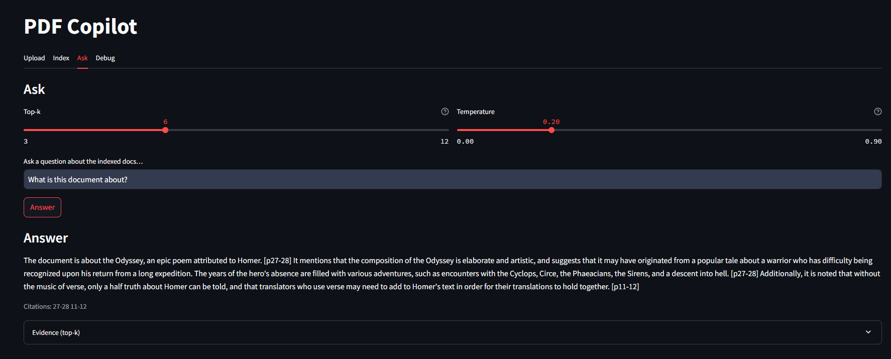

## Rohan Parekh's Portfolio
### LinkedIn: https://www.linkedin.com/in/rohan-parekh-39b070225/

Note - This repository is intended as a "gallery" of my work. You may pull these files to run them locally, but the datasets will need to be downloaded as well. All datasets are either externally linked here, or automatically install with the imported libraries.

### PDF Copilot (Retrieval Augmented Generation)

 
_(Sample screenshot)_
- Ask questions about any PDF and get a short answer with the exact page references used.
- Automatically splits long documents and builds a fast, reusable search index (FAISS) so results stay quick even for large files (saved locally).
- Runs with a local model (Mistral Instruct). Simple controls let you choose how many passages to check and how conservative/creative the answer should be.
- Built entirely with Python + Streamlit for the UI, PyMuPDF for PDF text, and a lightweight vector search engine (FAISS).

### Product Rec (Scikit-Learn/PyTorch)
- Recommends grocery items to users based on purchase history, item sale frequency, and other variables
- Collaborative filtering algorithm, utilizes K-Nearest-Neighbors from Scikit-Learn
- Public Instacart dataset (1,000,000+ transactions)
- [Dataset - Kaggle](https://www.kaggle.com/datasets/yasserh/instacart-online-grocery-basket-analysis-dataset)

### Spam Detector (PyTorch)
- Labels an inputted email as Spam or Non-Spam
- Utilizes Word2Vec embeddings and NLTK for tokenization
- 99% Accuracy
- [Dataset - Kaggle](https://www.kaggle.com/datasets/nitishabharathi/email-spam-dataset)

### Tweet Classifier (Tensorflow Keras)
- Determines positive or negative sentiment on a tweet
- Tweet inputs demonstrated at end
- Dataset imported in-file from NLTK's public twitter_samples library

### Customer Churn Predictor (TensorFlow Keras)
- Predicts customer churn on a bank dataset
- [Dataset - Kaggle](https://www.kaggle.com/datasets/gauravtopre/bank-customer-churn-dataset/data)

### Handwritten (PyTorch)
- Determines what digit is in an image of a handwritten number
- Ten distinct classes (numbers 0-9)
- [Dataset - Kaggle](https://www.kaggle.com/datasets/dhruvildave/english-handwritten-characters-dataset)

### Cifar10 Image classifier (TensorFlow Keras)
- Determines if an image is of a ship, automobile, deer, cat, etc.
- 10 distinct classes
- Dataset imported from Cifar10 library

### Life Expectancy Demo (No ML - only data analysis)
- Demonstration of cleaning, manipulating, and generating insights from a large dataset, including regression modeling
- Discrete steps + thought process explained with comments
- [Dataset - Kaggle](https://www.kaggle.com/datasets/lashagoch/life-expectancy-who-updated/data)
